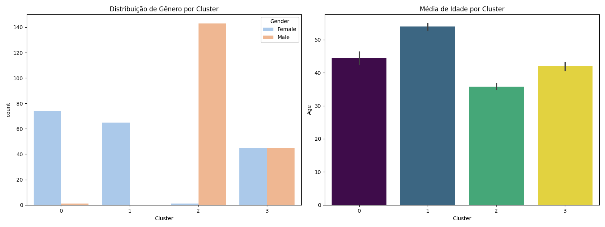
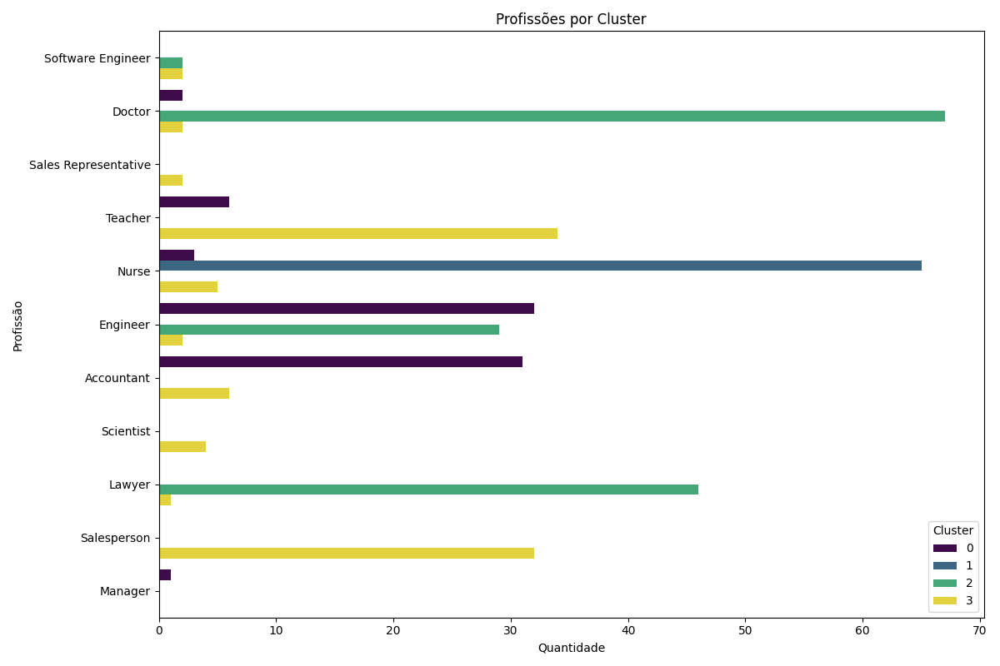
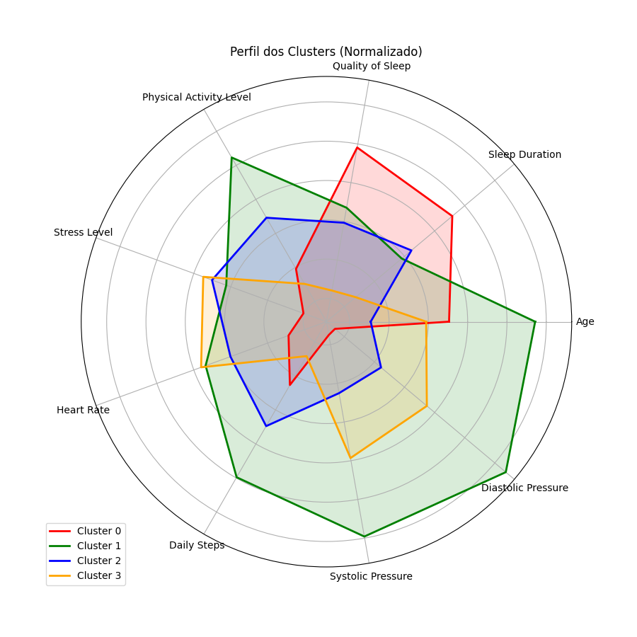

# Relatório Detalhado: Clustering de Sono e Estilo de Vida

## 1. Visão Geral dos Grupos
Total de pessoas analisadas: 374

### Quantidade por Cluster
|   Cluster |   count |
|----------:|--------:|
|         0 |      75 |
|         1 |      65 |
|         2 |     144 |
|         3 |      90 |

### Estatísticas Médias (Vital + Estilo de Vida)
|   Cluster |   Age |   Sleep Duration |   Quality of Sleep |   Physical Activity Level |   Stress Level |   Heart Rate |   Daily Steps |   Systolic Pressure |   Diastolic Pressure |
|----------:|------:|-----------------:|-------------------:|--------------------------:|---------------:|-------------:|--------------:|--------------------:|---------------------:|
|         0 | 44.47 |             7.76 |               8.45 |                     48.33 |           3.64 |        66.93 |       6225.33 |              119.85 |                77.55 |
|         1 | 53.95 |             7.1  |               7.52 |                     82.38 |           5.49 |        71.57 |       8415.38 |              140    |                95    |
|         2 | 35.83 |             7.22 |               7.29 |                     63.97 |           5.83 |        70.18 |       7201.39 |              125.67 |                82.25 |
|         3 | 41.94 |             6.49 |               6.24 |                     43.76 |           6.04 |        71.82 |       5540    |              132.16 |                86.93 |

---

## 2. Análise Demográfica e Social

### Quem são essas pessoas?

Abaixo vemos a divisão entre Homens e Mulheres em cada grupo, bem com a média de faixa etária em cada cluster.

### O que elas fazem? (Profissão)

Distribuição das ocupações profissionais dentro de cada cluster.

---

## 3. Análise de Saúde e Sono

### Perfil Geral (Radar Chart)

Comparativo visual das variáveis numéricas normalizadas.

### Riscos de Saúde (Distúrbios e IMC)

Relação entre peso e distúrbios do sono.

### Separação Matemática (PCA)

---
## 3. Metodologia
- **Algoritmo:** K-Means Clustering
- **K Ideal:** 4 (definido pelo Método do Cotovelo - confira saída nos arquivos)
- **Pré-processamento:** Padronização Z-Score e One-Hot Encoding para variáveis categóricas.

*Gerado em 21/11/2025*
